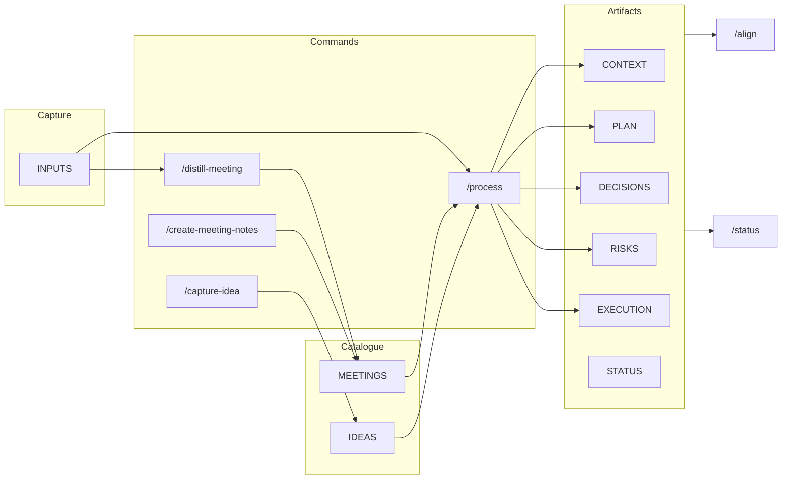

# Getting started with POAIS (for product managers)

This guide is for **using** POAIS with your portfolio after setup. If you haven't set up POAIS yet, follow the [setup instructions in README.md](README.md#setup) (create project folder, make a commit, run the CLI to add POAIS). Then open your repo in Cursor; the steps below assume POAIS is already installed. After setup you can run **`/setup-poais`** in Cursor for a guided "what's next" menu.

## What agent type to use and when

Cursor offers different modes. Use the one that matches what you want.

**Ask — "Explain, don't change"**  
Use when you want to **understand** something and nothing should be modified or run.  
*Examples:* "What does `/process` do?" "How do I add a new product to the portfolio?" "What's the difference between INPUTS and MEETINGS?" "Where is the upgrade script?"  
*Good for:* Learning POAIS, checking docs, exploring the repo, understanding a command before using it.  
*Limitation:* Ask can't run commands, edit files, or run scripts—so it can't do setup, upgrade, or process files.

**Plan — "Propose steps, I approve"**  
Use when you want a **clear plan** for a non-trivial or multi-step change, and to **approve it** before anything is done.  
*Examples:* "Reorganize our PLAN.md by quarter," "Add a new product and update POAIS_LOCK," "Audit DECISIONS and suggest consolidation," "Draft a release plan for this quarter."  
*Good for:* Bigger or structural changes, anything you want to review before execution.  
*Flow:* AI researches, writes a plan (and optionally a todo list), you confirm, then execution can happen (often in Agent mode).

**Agent — "Do it"**  
Use when you want the AI to **actually do the work**: run POAIS commands, edit artifacts, run scripts.  
*Examples:* Run `/setup-poais`, `/upgrade-poais`, `/process` on a file, `/create-meeting-notes`, `/capture-idea`, `/align`, `/status`; apply suggested edits to CONTEXT, PLAN, DECISIONS; run init or upgrade scripts.  
*Good for:* Normal POAIS workflow: capture → process → align → status, plus setup and upgrade.  
*Note:* Agent can run terminal commands (e.g. init/upgrade) and change files, so use it when you're ready for actions to be taken.

---

## Artifacts at a glance

| Artifact | Purpose |
|----------|---------|
| **CONTEXT** | Problem, who it serves, why now, success metric, constraints. Start here for a new product. |
| **PLAN** | Scope, non-goals, phasing, dependencies, tradeoffs. |
| **EXECUTION** | What is being built and delivered; tracks work. |
| **DECISIONS** | Log of decisions (date, decision, context, impact). See [STANDARDS.md](STANDARDS.md). |
| **STATUS** | Weekly snapshot for team/stakeholders; use `/status` to draft. |
| **DISCOVERY** | Customer/operational insights, assumptions, open questions, hypotheses. |
| **RISKS** | Known risks; update when scope or schedule risk emerges. |
| **ROADMAP** | Milestones (key delivery dates), current quarter, next, themes. Fed by PLAN, EXECUTION, DECISIONS. For stakeholder visibility and status/email. |
| **PRD** | Product Requirements Document: single source of truth for development handoff. Requirements for the product or feature; can be filled from CONTEXT, PLAN, EXECUTION, DECISIONS. Engineering works from PRD when implementing. |
| **INPUTS/** | **Single source for unstructured raw input** — notes, email, doc paste, meeting jottings; future API use (recordings/transcripts, inbox). Create a file here, add content, then run `/process` (general) or `/distill-meeting` (meeting notes). You can keep a **running input file**, add to it over time, and run `/process` in chunks; the file gets a **Processed (POAIS)** block at the end recording what was processed and when. |
| **MEETINGS/** | **Catalogued meeting records** — create live via `/create-meeting-notes` (fill during the meeting in Cursor) or from INPUTS via `/distill-meeting`. Run `/process` on a file here to extract key data and update artifacts. |
| **IDEAS/** | **Catalogued ideas** — create via `/capture-idea`; fill and refine or promote later with `/process`. |
| **FEATURES/** | Feature-level docs if you track them. |

---

## Where to start (by scenario)

### New product to build

Products live under `products/<name>/`. Seed **CONTEXT** in that product (problem, who it serves, why now). Add input to that product's INPUTS, run **`/process`**; run **`/align products/<name>`**. Ongoing: INPUTS + `/process`, or meeting jottings + `/distill-meeting` then `/process` on the MEETINGS file. See [STANDARDS.md](STANDARDS.md).

### New feature to add

Add input to the product's INPUTS; run **`/process`** or **`/distill-meeting`** then **`/process`** on the MEETINGS file. **`/align products/<name>`**. Optional: use FEATURES/.

### Quarterly roadmap

Focus **PLAN** and **ROADMAP** per product. Add inputs, run **`/process`**; distill meetings, then **`/process`**. **`/align products/<name>`**. Dates: ISO (YYYY-MM-DD) and taxonomy (Confirmed / Requested / Target / Constraint); see [.cursor/rules/25-dates-and-deadlines.md](.cursor/rules/25-dates-and-deadlines.md).

### Portfolio roll-up

**`/status products/<name>`** per product; **`/status portfolio`** to aggregate and write `portfolio/STATUS.md`. Add a product: create folder under `products/` and add path to POAIS_LOCK.json `products`.

---

## Workflow loop

**Capture** → INPUTS (per product). **Process** → `/process` (or `/distill-meeting` then `/process` on MEETINGS). **Sync** → CONTEXT, PLAN, DECISIONS, STATUS reflect reality ([STANDARDS.md](STANDARDS.md)). **Align** → `/align products/<name>`. **Communicate** → `/status products/<name>` (or with date) for STATUS.md; **`/status portfolio`** for roll-up; ROADMAP for stakeholders.

---

## Commands quick reference

| Command | Use |
|---------|-----|
| `/process products/<name>/INPUTS/YYYY-MM-DD-<slug>.md` | Turn one input file (or the next unprocessed chunk of a running file) into summary + proposed updates to DISCOVERY, PLAN, DECISIONS, RISKS, EXECUTION. Processed sections are recorded in a **Processed (POAIS)** block in the file. |
| `/process products/<name>/MEETINGS/YYYY-MM-DD-<slug>.md` | Run on a **catalogued meeting** to extract key data and update artifacts. Same chunked-processing and Processed (POAIS) block applies. |
| `/create-meeting-notes [products/<name>] [slug]` | Create a new meeting-notes file in MEETINGS/ for **live capture** in Cursor; fill during the meeting, then run `/process` on that file. |
| `/distill-meeting products/<name>/INPUTS/YYYY-MM-DD-<slug>.md` | Refine raw meeting jottings (in INPUTS) into a formatted meeting record; catalogue to MEETINGS/; then run `/process` on that file. |
| `/capture-idea [products/<name>] [slug]` | Create a new idea file in IDEAS/; fill and refine or promote later with `/process`. |
| `/align products/<name>` | Compare CONTEXT, PLAN, EXECUTION, DECISIONS (and optional ROADMAP); report drift and suggest fixes. |
| `/status products/<name>` or `/status portfolio` | Compose status drafts and update STATUS.md (or portfolio/STATUS.md for roll-up). |

[.cursor/commands/README.md](.cursor/commands/README.md) · [.cursor/README.md](.cursor/README.md) (index)

## Flow

