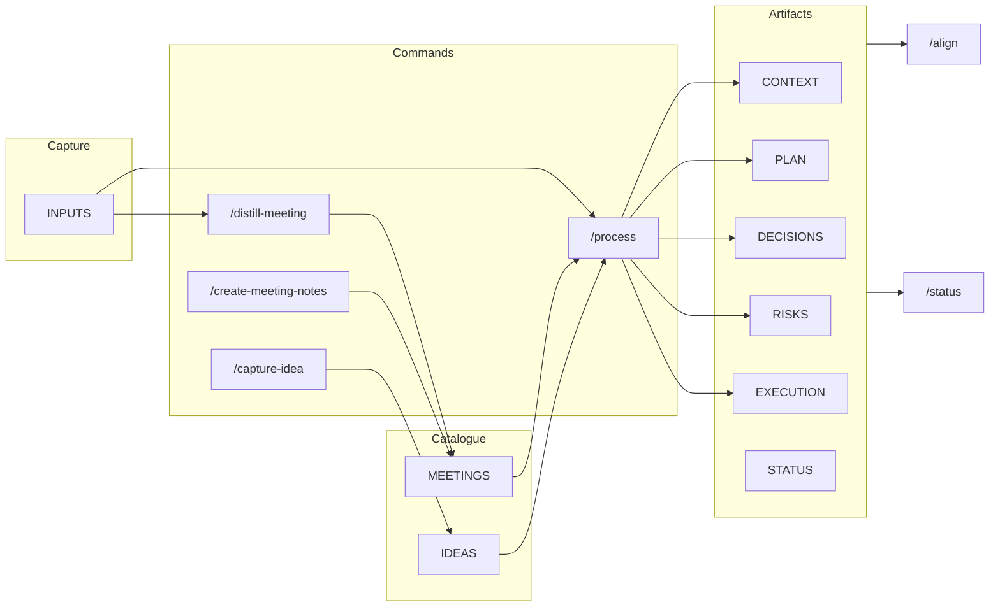

# Getting started with POAIS (for product managers)

For PMs after setup. Not set up yet? Run **`/setup-poais`** in Cursor; the agent will handle it. Workflows below assume you're in Cursor (commands, rules, skills, subagents).

## Artifacts at a glance

| Artifact | Purpose |
|----------|---------|
| **CONTEXT** | Problem, who it serves, why now, success metric, constraints. Start here for a new product. |
| **PLAN** | Scope, non-goals, phasing, dependencies, tradeoffs. |
| **EXECUTION** | What is being built and delivered; tracks work. |
| **DECISIONS** | Log of decisions (date, decision, context, impact). See [STANDARDS.md](STANDARDS.md). |
| **STATUS** | Weekly snapshot for team/stakeholders; use `/status` to draft. |
| **DISCOVERY** | Customer/operational insights, assumptions, open questions, hypotheses. |
| **RISKS** | Known risks; update when scope or schedule risk emerges. |
| **ROADMAP** | Milestones (key delivery dates), current quarter, next, themes. Fed by PLAN, EXECUTION, DECISIONS. For stakeholder visibility and status/email. |
| **INPUTS/** | **Single source for unstructured raw input** — notes, email, doc paste, meeting jottings; future API use (recordings/transcripts, inbox). Create a file here, add content, then run `/process` (general) or `/distill-meeting` (meeting notes). |
| **MEETINGS/** | **Catalogued meeting records** — create live via `/create-meeting-notes` (fill during the meeting in Cursor) or from INPUTS via `/distill-meeting`. Run `/process` on a file here to extract key data and update artifacts. |
| **IDEAS/** | **Catalogued ideas** — create via `/capture-idea`; fill and refine or promote later with `/process`. |
| **FEATURES/** | Feature-level docs if you track them. |

---

## Where to start (by scenario)

### New product to build

Seed **CONTEXT** (problem, who it serves, why now). Add input to INPUTS, run **`/process`**; run **`/align product`**. Ongoing: INPUTS + `/process`, or meeting jottings + `/distill-meeting` then `/process` on the MEETINGS file. See [STANDARDS.md](STANDARDS.md).

### New feature to add

Add input to INPUTS; run **`/process`** or **`/distill-meeting`** then **`/process`** on the MEETINGS file. **`/align product`**. Optional: use FEATURES/.

### Quarterly roadmap

Focus **PLAN** and **ROADMAP**. Add inputs, run **`/process`**; distill meetings, then **`/process`**. **`/align product`**. Dates: ISO (YYYY-MM-DD) and taxonomy (Confirmed / Requested / Target / Constraint); see [.cursor/rules/25-dates-and-deadlines.md](.cursor/rules/25-dates-and-deadlines.md).

### Portfolio (multiple products)

Products under `products/<name>/`; optional `portfolio/` (PRIORITIES, STATUS roll-up). **`/align products/<name>`**, **`/status products/<name>`**, **`/status portfolio`**. Add product: create folder + add to POAIS_LOCK.json `products`.

---

## Workflow loop

**Capture** → INPUTS. **Process** → `/process` (or `/distill-meeting` then `/process` on MEETINGS). **Sync** → CONTEXT, PLAN, DECISIONS, STATUS reflect reality ([STANDARDS.md](STANDARDS.md)). **Align** → `/align product`. **Communicate** → `/status product` (or with date) for STATUS.md; ROADMAP for stakeholders.

---

## Commands quick reference

| Command | Use |
|---------|-----|
| `/process product/INPUTS/YYYY-MM-DD-<slug>.md` | Turn one input file into summary + proposed updates to DISCOVERY, PLAN, DECISIONS, RISKS, EXECUTION. |
| `/process product/MEETINGS/YYYY-MM-DD-<slug>.md` | Run on a **catalogued meeting** to extract key data and update artifacts. |
| `/create-meeting-notes [product] [slug]` | Create a new meeting-notes file in MEETINGS/ for **live capture** in Cursor; fill during the meeting, then run `/process` on that file. |
| `/distill-meeting product/INPUTS/YYYY-MM-DD-<slug>.md` | Refine raw meeting jottings (in INPUTS) into a formatted meeting record; catalogue to MEETINGS/; then run `/process` on that file. |
| `/capture-idea [product] [slug]` | Create a new idea file in IDEAS/; fill and refine or promote later with `/process`. |
| `/align product` or `/align products/<name>` | Compare CONTEXT, PLAN, EXECUTION, DECISIONS (and optional ROADMAP); report drift and suggest fixes. |
| `/status product` or `/status products/<name>` or `/status portfolio` | Compose status drafts and update STATUS.md (or portfolio/STATUS.md for portfolio). |

[.cursor/commands/README.md](.cursor/commands/README.md) · [.cursor/README.md](.cursor/README.md) (index)

## Flow

