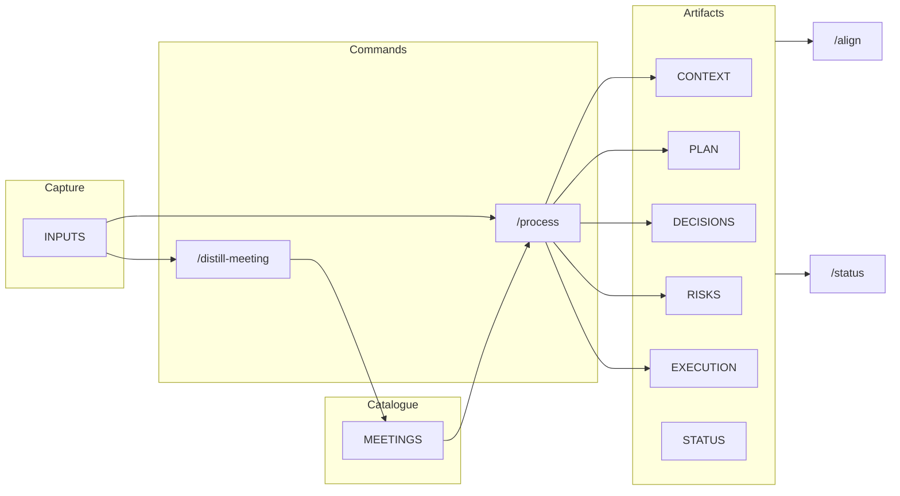

# Getting started with POAIS (for product managers)

This guide is for PMs who have finished [setup](README.md#quickstart) and need to know **where to start** and **how to work** with POAIS in Cursor.

---

## Artifacts at a glance

| Artifact | Purpose |
|----------|---------|
| **CONTEXT** | Problem, who it serves, why now, success metric, constraints. Start here for a new product. |
| **PLAN** | Scope, non-goals, phasing, dependencies, tradeoffs. |
| **EXECUTION** | What is being built and delivered; tracks work. |
| **DECISIONS** | Log of decisions (date, decision, context, impact). See [STANDARDS.md](STANDARDS.md). |
| **STATUS** | Weekly snapshot for team/stakeholders; use `/status` to draft. |
| **DISCOVERY** | Customer/operational insights, assumptions, open questions, hypotheses. |
| **RISKS** | Known risks; update when scope or schedule risk emerges. |
| **ROADMAP** | Milestones (key delivery dates), current quarter, next, themes. Fed by PLAN, EXECUTION, DECISIONS. For stakeholder visibility and status/email. |
| **INPUTS/** | **Single source for all raw input** — notes, email, doc paste, and meeting jottings. Create a blank .md here, jot notes, then run `/process` (general input) or `/distill-meeting` (meeting notes). |
| **MEETINGS/** | **Catalogued meeting records** — refined, formatted output of `/distill-meeting`. Run `/process` on a file here to extract key data and update artifacts. |
| **FEATURES/** | Feature-level docs if you track them. |

---

## Where to start (by scenario)

### New product to build

1. **Seed CONTEXT** — Fill `product/CONTEXT.md` with: problem, who it serves, why now, success metric, constraints (use the template headings).
2. **Add raw input** — Create `product/INPUTS/YYYY-MM-DD-<slug>.md` with a brief, email, or doc paste (or use `/process` and paste content in chat when prompted).
3. **Run `/process`** on that file — You get a summary and proposed updates to DISCOVERY, PLAN, DECISIONS. Review and approve edits.
4. **Tighten alignment** — Run `/align product` to check CONTEXT, PLAN, EXECUTION, DECISIONS for consistency.
5. **Ongoing** — Keep CONTEXT and PLAN in sync; feed new input via INPUTS + `/process`, or meeting jottings in INPUTS + `/distill-meeting` (refines and catalogues to MEETINGS), then `/process` on the MEETINGS file to update artifacts.

### New feature to add

1. **Assume CONTEXT and PLAN exist** — Your product already has them.
2. **Add input** — Put a spec, request, or meeting jottings in `product/INPUTS/`.
3. **Run `/process`** on general input, or **`/distill-meeting`** on meeting notes (refines and catalogues to MEETINGS), then **`/process`** on the catalogued MEETINGS file — Review proposed updates to PLAN, EXECUTION, DECISIONS, RISKS.
4. **Run `/align product`** — Keep artifacts consistent.
5. **Optional** — Use `product/FEATURES/` for feature-level docs if you track them.

### Quarterly roadmap

1. **Focus on PLAN and ROADMAP** — Phasing, scope, non-goals; current quarter and themes.
2. **Add inputs** — Strategy doc, leadership ask, or constraints into `product/INPUTS/YYYY-MM-DD-<slug>.md`.
3. **Run `/process`** — Extract milestones, decisions, and risks into PLAN, DECISIONS, RISKS.
4. **Distill key meetings** — Put meeting jottings in `product/INPUTS/`, run `/distill-meeting` to refine and catalogue to MEETINGS, then run `/process` on the catalogued file to capture decisions and actions in artifacts.
5. **Run `/align product`** — Ensure ROADMAP and PLAN stay aligned.
6. **Dates** — Use ISO dates (YYYY-MM-DD) and the deadline taxonomy (Confirmed / Requested / Target / Constraint). See [.cursor/rules/25-dates-and-deadlines.md](.cursor/rules/25-dates-and-deadlines.md).

### Portfolio (multiple products)

1. **Layout** — Products live under `products/<name>/` (e.g. `products/widget/`, `products/api/`). Optional `portfolio/` at repo root holds PRIORITIES.md and STATUS.md (roll-up). Initialize with `poais-init.sh --layout=portfolio [names]` or `poais-init.ps1 -Layout Portfolio`.
2. **Per product** — Run `/align products/<name>`, `/status products/<name>`, `/process products/<name>/INPUTS/...`, `/distill-meeting products/<name>/INPUTS/...` as for single-product; the catalogued meeting is written to that product’s MEETINGS/.
3. **Portfolio roll-up** — Run **`/status portfolio`** to aggregate status across all products (from POAIS_LOCK.json) and write `portfolio/STATUS.md`.
4. **Adding a product** — Create the folder under `products/` with the same artifact set (or run init with portfolio mode and new product names), then add the path to POAIS_LOCK.json `products` array.

---

## Expected workflow loop

- **Capture** — Add all raw input (including meeting jottings) to INPUTS.
- **Process** — Run `/process` on general input; for meetings, run `/distill-meeting` on the INPUTS file (refines and catalogues to MEETINGS), then `/process` on the MEETINGS file; review and approve proposed edits to DISCOVERY, PLAN, DECISIONS, RISKS, EXECUTION.
- **Keep in sync** — Update CONTEXT, PLAN, DECISIONS, STATUS as reality changes (see [STANDARDS.md](STANDARDS.md): POAIS reflects reality).
- **Align** — Run `/align product` periodically to catch drift.
- **Communicate** — Run `/status product` (or `/status product YYYY-MM-DD`) to draft stakeholder updates and update STATUS.md. ROADMAP can be pasted into status emails or shared separately for alignment with stakeholders.

---

## Commands quick reference

| Command | Use |
|---------|-----|
| `/process product/INPUTS/YYYY-MM-DD-<slug>.md` | Turn one input file into summary + proposed updates to DISCOVERY, PLAN, DECISIONS, RISKS, EXECUTION. |
| `/process product/MEETINGS/YYYY-MM-DD-<slug>.md` | Run on a **catalogued meeting** (output of `/distill-meeting`) to extract key data and update artifacts. |
| `/distill-meeting product/INPUTS/YYYY-MM-DD-<slug>.md` | Refine raw meeting jottings into a formatted meeting record; catalogue to MEETINGS/; then run `/process` on that file to update artifacts. |
| `/align product` or `/align products/<name>` | Compare CONTEXT, PLAN, EXECUTION, DECISIONS (and optional ROADMAP); report drift and suggest fixes. |
| `/status product` or `/status products/<name>` or `/status portfolio` | Compose status drafts and update STATUS.md (or portfolio/STATUS.md for portfolio). |

Full syntax and options: [.cursor/commands/README.md](.cursor/commands/README.md).

---

## Flow (overview)

